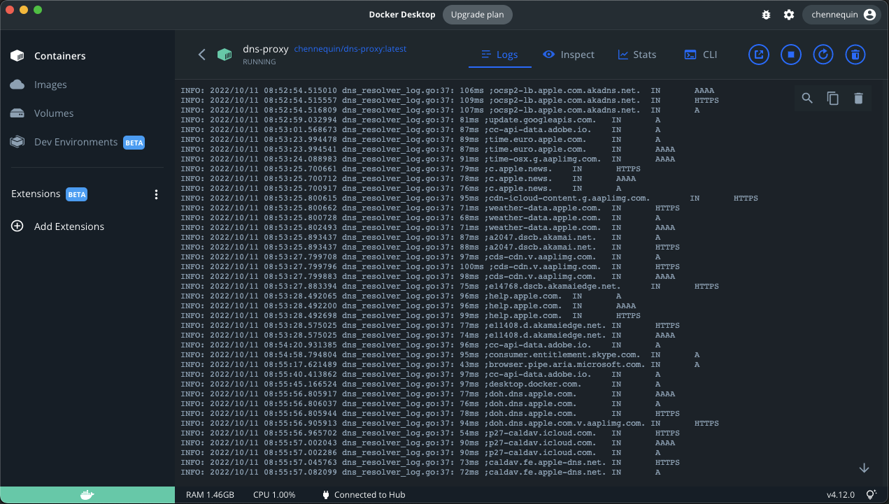

# dns-proxy

DNS server with a security focus which acts as a proxy and delegate UDP requests to well known DoH servers: Google, CloudFlare, Quad9.
- do not rely on the host root certificates. Uses known and validated root certificates only.
- do not rely on the host time. Make use of rough time instead.
- do not trust remote answers. Perform full DNSSEC validation. Systematically ask for +dnssec answers.

Default settings delegates queries to Google DNS over HTTPS servers.



Pre-requisites:
- to have Docker installed

Installation:
 ```shell
 docker run -d -p 127.0.0.1:53:53/udp --name dns-proxy --mount source=dns-proxy,target=/tmp --restart=always chennequin/dns-proxy:latest
 ```

Setup your local DNS settings to 127.0.0.1
